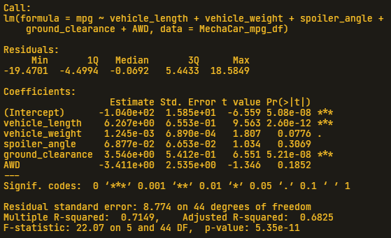

# MechaCar_Statistical_Analysis

## Linear Regression to Predict MPG

  

  
- As shown in the above results, the coefficients of ***Vehicle Length*** and ***Ground Clearance*** provide the most non-random amnount of varianmce to the MPG values and are statistically significant. Furthermore, the ***Intercept*** is also statistically significant, but this may mean that the significant features need scaling or transforming to help improve the predictive power of the model. It also may meant that there are other variables can help explain the variability of the MPG variable that have not been included in our model.

- In this specific linear model, we can not consider the slope to be zero. This is due to the factr that the P-value of **5.35e-11** is signicantally lower that the level of significance. This also means that the null hypothesis must be rejected, as the P-value indicates a incredibly low chance that these results were due to random chance.

- Through the summarization of the linear model and coefficients, the R-squared value of 0.7149, or ~71%, indicates a relatively accurate predicted model. The effectiveness is questionable though, and a higher R-squared value would be more ideal to have an effective model predict the ***MPG*** of the **MechaCar** prototypes.
