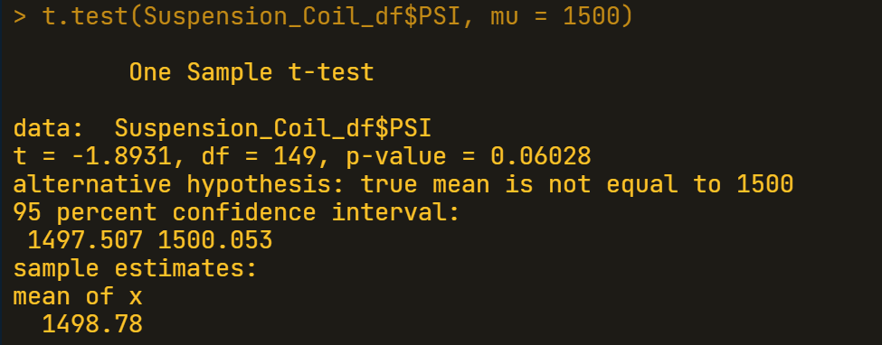
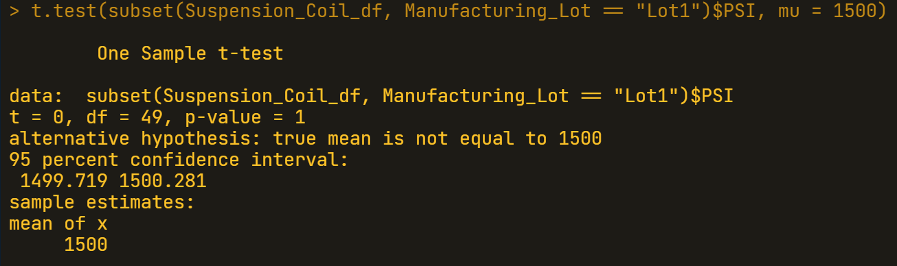

# MechaCar_Statistical_Analysis

## Linear Regression to Predict MPG

### Technical Analysis

 
Linear Regression to Predict MPG

 

### Written Summary

- As shown in the above results, the coefficients of ***Vehicle Length*** and ***Ground Clearance*** provide the most non-random amount of variance to the MPG values and are statistically significant. Furthermore, the ***Intercept*** is also statistically significant, but this may mean that the significant features need scaling or transforming to help improve the predictive power of the model. It also may mean that there are other variables that can help explain the variability of the ***MPG*** variable and have not been included in our model.

- In this specific linear model, we cannot consider the slope to be zero. This is due to the factor that the p-value of **5.35e-11** is significantly lower that the level of significance. This also means that the null hypothesis must be rejected, as the p-value indicates an incredibly low chance that these results were due to random chance.

- Through the summarization of the linear model and coefficients, the R-squared value of **0.7149**, or **~71%**, indicates a relatively accurate predicted model. The effectiveness is questionable though, and a higher R-squared value would be more ideal to have an effective model predict the ***MPG*** of the **MechaCar** prototypes.

 
 

## Summary Statistics on Suspension Coils

### Technical Analysis

 
Summary Statistics on Suspension Coils Across All Manufacturing Lots

 
Summary Statistics on Suspension Coils for Each Manufacturing Lot

 

### Written Summary

- A summary analysis was done on both the total and by manufacturing lots of the MechaCar suspension coils to see if the variances were within specification. The design specifications dictates that the variance cannot exceed **100** ***PSI***. For the total summary the variance is well within the design specifications at a variance of **62.29** ***PSI***. For the summary on the manufacturing lots we can see that while Lot 1 and Lot 2 are well within the variance specifications, Lot 3 far exceeds the specifications with a variance of **170.28** ***PSI***.

 
 

## T-Tests on Suspension Coils

- Further analysis was needed, so another script was written to determine if the PSI across all of the manufacturing lots was statistically different from the population mean of **1,500** ***PSI***. This was done with a t-tests to test our null hypothesis.

### Technical Analysis and Written Summaries

 
Summary T-Test on Suspension Coils Across All Lots

- The first t-test was a summary test across all of the lots. The data shows a p-value of **0.06028**, which is higher than our assumed significance level of **0.05**, which implies that we do not have enough evidence to reject the null hypothesis and the sum of the lots is not statistically different from the population mean.

 

 
T-Test Lot 1 Suspension Coils

- The next t-test was done on Lot 1. The p-value of **1** shows that this lot is not statistically different from the population mean, and there is not enough evidence to reject the null hypothesis.

 
T-Test Lot 2 Suspension Coils</end>

- The third test was done on Lot 2. This lot had a p-value of **0.6072**. This p-value also showed that this lot was not statistically different that the population mean, and also here there is not enough evidence to reject the null value.

T-Test Lot 3 Suspension Coils

- The final test was done on Lot 3, and produced a p-value of **0.04168**. This value was slightly below our assumed significance level and is just barely statistically different from the population mean. This also means that the p-value is just low enough for us to reject the null hypothesis. Lot 3 has shown through our tests that closer inspection should be conducted to understand why the variance is so high and the statistical difference being off from the population mean.

 
 

## Study Design: MechaCar vs Competition

- In considering the many ways to statistically cover the performance of the MechaCar versus the Competition, a metric of city and highway fuel efficiency would be a pertinent study considering the growing volatility of fuel prices in our current climate.

- The Null Hypothesis would be that there is no significant difference in gas mileage both for city and highway when comparing the MechaCars against like competition in the same vehicle classes.
The Alternative Hypothesis would instead show that there is a statistical and significant difference in the city and highway gas mileage conducted against like vehicle classes.

- To begin the testing, a pair t-test would allow us to see if there is a statistical difference in gas mileage between MechaCars and like competition in the same vehicle classes.

- For the testing the city and highway efficiency data would need to be collected from each vehicle class of MechaCars and like vehicles against each competition’s vehicle classes.
